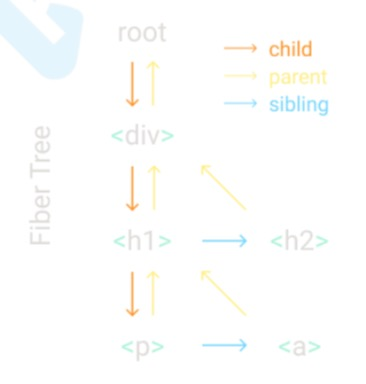

## 摘要
react16+的核心源码手写，在16版本class component已经不是必须的，重点内容是function component+hooks, 底层实现fiber架构

## jsx
jsx是通过babel转义成React.createElement执行，构建虚拟dom。
这就是为什么写了jsx就一定需要import react的原因。

## createElement

```html
   <div id='container'>
        <input value="foo" />
        <a href="/bar" />
        <span></span>
   </div>
```
解析成

```javascript

    React.createElement('div', {id: 'container'},
        React.createElement('input', {value: 'foo'}),
        React.createElement('a', {href: '/bar'}),
        React.createElement('span', null))
```

因此就期待返回

```javascript
    const element = {
      type: "div",
      props: {
        id: "container",
        children: [
          { type: "input", props: { value: "foo"} },
          { type: "a", props: { href: "/bar" } },
          { type: "span", props: {} }
    ] }
    };
```
那么createElement方法就知道怎么写了

## render
需要将vdom转为真正的dom，就需要遍历并创建dom

## Concurrent
注意上⾯面的render，一旦开始，就开始递归，本身这个没啥问题，但是如果应⽤用变得庞⼤大后，会有卡顿，后⾯面状态修改后的diff也是一样，整个vdom对象变⼤大后，diff的过程也有会递归过多导致的卡顿。
如何解决这个问题？
浏览器有一个api requestIdleCallback 可以利用浏览器的业余时间，我们可以把任务分成⼀个个的⼩任务，然后利用浏览器空闲时间来做diff，如果当前有任务来了，⽐如⽤户的点击或者动画，会先执行，然后空闲后，再回去把requestIdleCallback没完成的任务完成。
当然react已经重写了调度逻辑，不用requestIdleCallback了，但是过程是一致的。


## fiber
有了调度逻辑，之前的vdom结构是一个树形结构，diff过程是不能中断的。为了管理我们的vdom树之间的关系，我们需要把树形结构的内部关系，改成链表之前，树形结构中对children作为一个数组遍历获得数据，改成容易中断的链表结构，增加了父=>子，子=>父关，子=>兄弟关系。
整个任务从render开始，然后每次只遍历一个小单元，一旦被打断那么就去执行优先级更高的任务（用户交互、动画），结束之后由于停留的元素知道父子兄弟关系，就可以恢复遍历状态。




